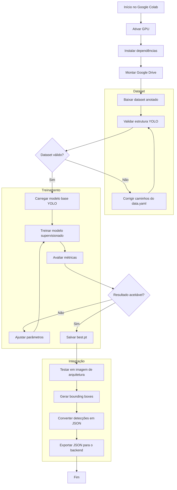

```mermaid
flowchart TD
    A[Início no Google Colab] --> B[Ativar GPU]
    B --> C[Instalar dependências]
    C --> D[Montar Google Drive]
    D --> E[Baixar dataset anotado]
    E --> F[Validar estrutura YOLO]

    F --> G{Dataset válido?}
    G -- Não --> H[Corrigir caminhos do data.yaml]
    H --> F

    G -- Sim --> I[Carregar modelo base YOLO]
    I --> J[Treinar modelo supervisionado]
    J --> K[Avaliar métricas]

    K --> L{Resultado aceitável?}
    L -- Não --> M[Ajustar parâmetros]
    M --> J

    L -- Sim --> N[Salvar best.pt]
    N --> O[Testar em imagem de arquitetura]
    O --> P[Gerar bounding boxes]
    P --> Q[Converter detecções em JSON]
    Q --> R[Exportar JSON para o backend]
    R --> S[Fim]

    subgraph Dataset
        E
        F
        H
    end

    subgraph Treinamento
        I
        J
        K
        M
        N
    end

    subgraph Integração
        O
        P
        Q
        R
    end
```
