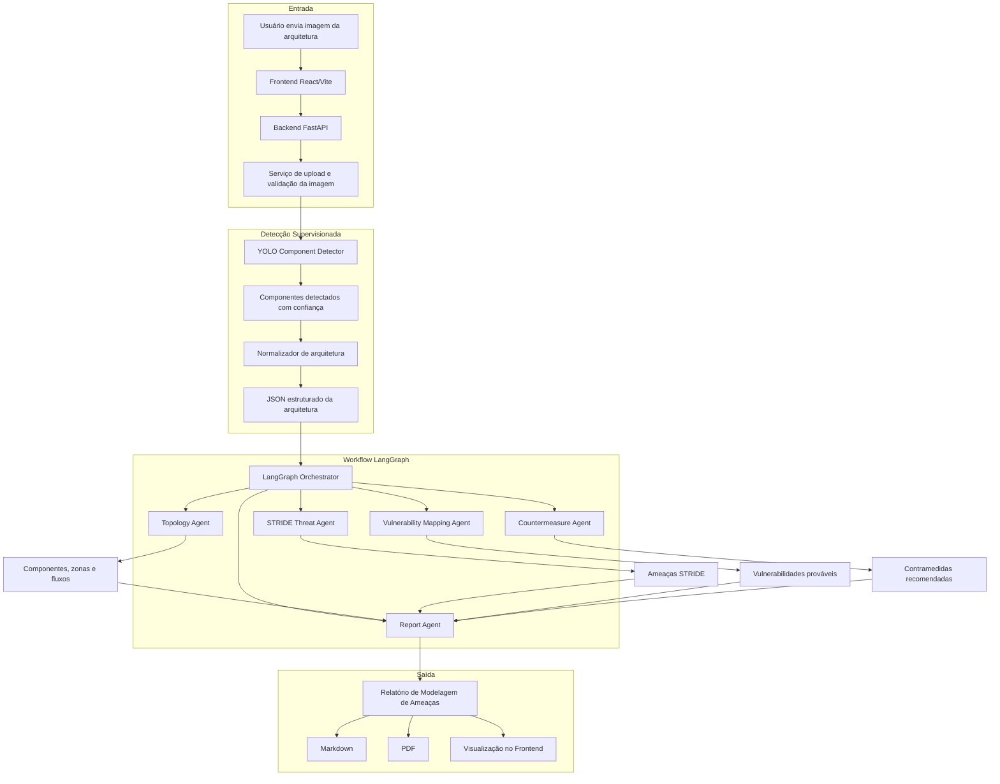

```mermaid
flowchart TD
    A[Usuário envia imagem da arquitetura] --> B[Frontend React/Vite]
    B --> C[Backend FastAPI]
    C --> D[Serviço de upload e validação da imagem]

    D --> E[YOLO Component Detector]
    E --> F[Componentes detectados com confiança]
    F --> G[Normalizador de arquitetura]
    G --> H[JSON estruturado da arquitetura]

    H --> I[LangGraph Orchestrator]

    I --> J[Topology Agent]
    I --> K[STRIDE Threat Agent]
    I --> L[Vulnerability Mapping Agent]
    I --> M[Countermeasure Agent]
    I --> N[Report Agent]

    J --> O[Componentes, zonas e fluxos]
    K --> P[Ameaças STRIDE]
    L --> Q[Vulnerabilidades prováveis]
    M --> R[Contramedidas recomendadas]

    O --> N
    P --> N
    Q --> N
    R --> N

    N --> S[Relatório de Modelagem de Ameaças]
    S --> T[Markdown]
    S --> U[PDF]
    S --> V[Visualização no Frontend]

    subgraph Entrada
        A
        B
        C
        D
    end

    subgraph Detecção Supervisionada
        E
        F
        G
        H
    end

    subgraph Workflow LangGraph
        I
        J
        K
        L
        M
        N
    end

    subgraph Saída
        S
        T
        U
        V
    end
```
